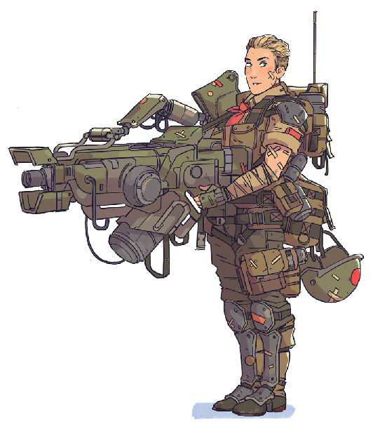

# Brava Hadura (she/her) — Friendly, Steadfast, Empathetic

    

Brava Hadura is the commander of [Evergreen's](../places/evergreen.md) militia, appointed by [Patience](./patience.md) themselves. Prior to the appearance of the raiders, she primarily acted as Evergreen's first-response mediator, resolving disputes between colonists to ensure peaceful outcomes. She's long been a popular presence in the colony — a trusted neutral party and counselor among the labor- and engineering-track citizens.

She carries an enhanced kit while on duty: a slim exoskeleton to enhance her stamina and strength, a tertiary arm to help her wield her primary weapon (a heavy anti-armor rifle), and eco-integrated body armor alongside a sidearm and a range of other complementary gear and equipment.
