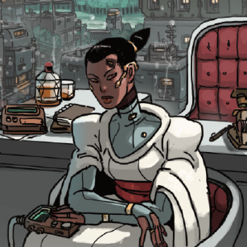

# Edena Ji (she/her) — Competent, Level-Headed, Mindful

    

Edena Ji is [Patience's](patience.md) attaché — the colonial administrator's chief operations officer and right-hand woman. A second-generation colonist, Edena is Patience's second COO and has held the position for a decade. She works with a single-minded devotion to see Patience's will carried out.

Edena's knowledge of [Evergreen](../../places/evergreen.md) and its citizenry is unparalleled; so too is her knowledge of the [Gray Towns](../../places/gray-towns.md). She defends the unfoficial settlements from Patience's desire to see them "cleaned up"; they may not be legal, but they *are* helpful — and not for nothing, they're also far easier targets for the raiders, and worth keeping around for that reason.

Edena is rarely found outside the main administrative buildings and works seemingly around the clock. Her decision making trends towards strictly utilitarian, her calculus occasionally seems to slip and reveal a deeply-buried humanitarian streak that's always followed by reflexive course correction.
