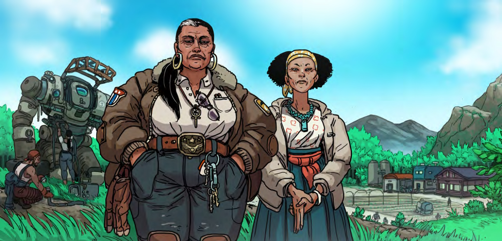

# Liu Maize
Liu Maize is the second largest of the [Gray Towns](../gray-towns.md), and the furthest known community from [Evergreen](../evergreen.md).

Liu Maize originated as a collective of homesteads bound together by an agreement of mutual aid and unconditional hospitality. At the time, those homesteads were affiliated with Evergreen, and the compact was a practical measure intended to assist in maintaining stability so far out from the burgeoning colony, which could provide little support; over time, though, it's gradually formed into a collective of independent farms under a single name, bound together by what has evolved into a charter, legal document, and code of conduct all in one: the Compact.
## Layout and Surroundings
Today, Liu Maize refers to both the aid network bound together by the Compact as well as to the crossroads town that has sprung up roughly in the middle of the farms, where the homesteaders gather and mingle. Evergreen's legal definition encompasses only the latter. It's largely built of prefabs acquired by the settlement from Evergreen surplus, but mixed-material buildings stand out here and there on the outskirts of wide dirt roads that make room for trucks and industrial mechs.

Unlike Evergreen and [Merricktown](merricktown.md), Liu Maize is landlocked; its infrastructure can't rely on the wide, slow river that facilitates daily life for [Hercynia's](../../things/hercynia.md) other settlers. Without running water to cool a fusion reactor, the town relies on wind farms and lots of batteries in order to keep the lights on. The constant rain in this part of the continent means that solar power is unreliable, but it's also a boon: the municipal water supply is largely treated storm water, collected in massive barrels on the edge of the settlement and purified in a prefab treatment plant that rests at the town's heart.

The "town" of Liu Maize itself is very small; you can walk from one end to the other in less than ten minutes. But the bulk of its population is concentrated in the scattered farmsteads throughout the flat, nutrient-rich tracts of loamy soil that dominate this part of the valley.
## Culture
Liu Maize values personal freedoms much more highly than Evergreen. Relations between the two settlements soured largely thanks to [Landmark's](../../factions/landmark-colonial.md) strict control over colonists' schedules and livelihoods, and so the Compact makes an ideal out of the opposite. Every signee of Liu Maize is there by choice, and a member can withdraw themselves from the network at any time and for any reason. Resources are managed and distributed collectively; homesteads keep each other updated on what they have and share what they need to. This has run into some friction as more and more independent settlers join the cooperative, but for the time being it's managed to work itself out.

The collective is entirely subsistent on agriculture, supplemented by logging and light, surface-level mining. Nearly half of the valley's food flows through Liu Maize, and it's led to a thriving culinary scene. Visitors on official Landmark business tend to be met with a frosty reception — but friendly faces are met with warmth and hospitality that's often characterized by having more free food given to them than they know what to do with.
## Locations
### The Pagan Goddess
Built out of sturdy logs and sitting right near the center of Liu Maize's town, this bustling public house is one of the oldest buildings in the collective. As the town's one and only true gathering place, the Pagan Goddess (a shortening of its full name, "The Pagan Goddess of Swamps and Sticks") is packed nearly every hour of every day, and does double-duty as a town hall when it needs to. Lit by lanterns and typically backgrounded by local musicians, it carries an easy, homely atmosphere that nowhere else on Solo Terra can beat.

"The Pagan Goddess" is a nickname both for the establishment and its owner: a tall, tanned woman known only as Leshy. A former IPS-N Trunk Security officer with a decade-long track record in the Long Rim, she built the place, and she makes sure everyone knows it. Spent shells, burnt bulkheads, and wrecked mech parts line the walls as decoration, but nobody misses the Shears: a crossed pair of huge, vicious blades torn from pipecleaner subalterns and mounted above the double doors.

This establishment is mythologized in Evergreen for its house liquor, known simply as the 94. Distilled from a native species of fruit, it has a tangy punch not unlike mango — and a painful, blazing burn that tends to make first-time drinkers realize why it has the name that it does.
### Water Treatment Plant
Sequestered a stone's throw away from the Pagan Goddess, this water purification facility is the lifeblood of Liu Maize. Homesteads typically have their own water infrastructure, but everything and everyone in the town itself relies on the fresh, clean water that's treated here. It's technologically the most modern part of town, and one of the few places that's kept guarded at effectively all times; damage to the treatment plant means the whole cooperative suffers.
### Châu Farm

    
    <i>Maggie and Weiyi Châu</i>

The Châus are a hardscrabble farming family with several homesteads around Liu Maize. Matriachs Maggie and Weiyi Châu arrived in Evergreen thirty years ago on a jury-rigged hauling skiff, and spent several years working construction jobs around the colony before their noncitizen status was discovered and they were expelled.

The Châus distill the house special for the Pagan Goddess, and sell produce to traders, militia, and colonists alike. They've had ten children in the thirty years since, and taken as a whole, the extended family is central to Liu Maize's economy. The Compact recognizes no one member above another, but unofficially speaking, the Châus are core to the collective; they know the land and people listen when they speak.

The family's largest homestead (the one most people know as "the Châus") is only a short trip away from town, and oversees rice paddies and cornfields that have become waterlogged in the monsoon season. Many of Liu Maize's workers make their living there.